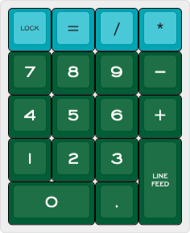
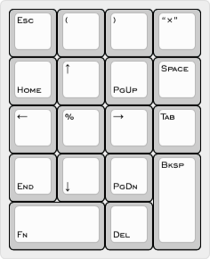

# ai03 <em>Soyuz</em> numpad - ZeroFn layout

 

<http://www.keyboard-layout-editor.com/#/gists/1d3a53dbff4ec23c2ccb529c8483dda7>

-----

18-key numeric keypad layout for macOS.

* <kbd>=</kbd> key on Row 1
* 1u <kbd>+</kbd> key on Row 3
* Holding <kbd>0</kbd> activates <kbd>Fn</kbd> layer

## <em>ZeroFn</em> layer

* <kbd>Esc</kbd> on <kbd>Clear</kbd> / <kbd>Num Lock</kbd>
* <kbd>Backspace</kbd> on <kbd>Enter</kbd>
* <kbd>Tab</kbd> on <kbd>+</kbd>
* <kbd>Space</kbd> on <kbd>&minus;</kbd>
* traditional 10-key navigation cluster
  * no <kbd>Insert</kbd> key
* additional characters:
  * multiplication sign: <kbd>&times;</kbd> on <kbd>*</kbd>
  * percent sign: <kbd>%</kbd> on <kbd>5</kbd>
  * left parenthesis: <kbd>(</kbd>  on <kbd>=</kbd>
  * right parenthesis <kbd>)</kbd>  on <kbd>/</kbd>

## Keycaps

* 12 from [SA Nuclear Data](https://pimpmykeyboard.com/sa-nuclear-data-keyset-two-shot/)
* 4 from [SA Pulse](https://drop.com/buy/pulse-sa-keycap-set)
