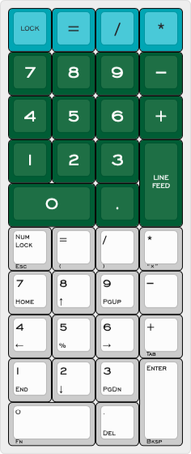

# ai03 <em>Soyuz</em> numpad

<http://www.keyboard-layout-editor.com/#/gists/1d3a53dbff4ec23c2ccb529c8483dda7>

18-key numeric keypad layout for macOS. Holding <kbd>0</kbd> key activates navigation layer.

## Keycap Colorway & Legends

[SA Nuclear Data](https://pimpmykeyboard.com/sa-nuclear-data-keyset-two-shot/) uniform R3 keycaps, with R1 top row from [SA Pulse](https://drop.com/buy/pulse-sa-keycap-set)
