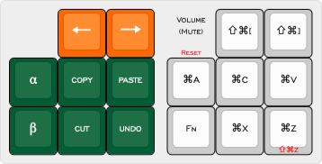

# Keebio _BDN9 Rev. 2_

<http://www.keyboard-layout-editor.com/#/gists/7143ad2c7e2da63c36a4aeff043d9a78>

-----

9-key macro pad configured with 8 MX switches + 1 rotary encoder.

Keycaps from [SA Nuclear Data](https://pimpmykeyboard.com/sa-nuclear-data-keyset-two-shot/) <em>Radioactive</em> and <em>Edit</em> kits.
