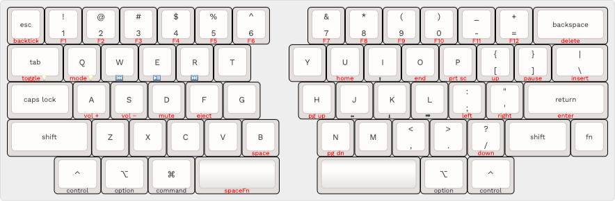
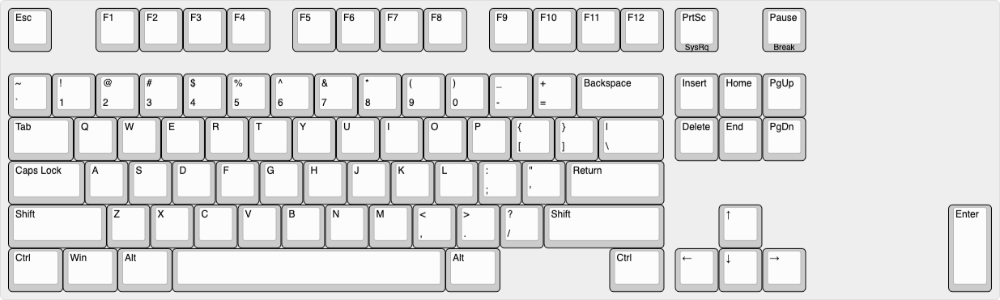

# Keebio _Quefrency Rev. 4_ - 60%

KLE layout: <http://www.keyboard-layout-editor.com/#/gists/69eaf79c79cee5e88ad23d3aa2c4c905>

A <strong>61-key QWERTY split staggered keyboard layout</strong> for macOS, inspired by [HHKB](https://hhkb.io/layout/) and [SpaceFn](https://geekhack.org/index.php?topic=51069.0) layouts.

Tenkeyless access to <strong>85 keys</strong> of the US ANSI 104-key layout — plus <strong>media keys</strong> & <strong>underglow lighting control</strong> — using <strong>one (1) layer</strong>.

Uses [Quefrency Rev. 4](https://keeb.io/collections/quefrency-split-staggered-65-keyboard/products/quefrency-rev-4-65-split-staggered-keyboard) hotswap PCBs with left macro section and rightmost column broken off.

## Rationale

I have been using split keyboards for a couple years now, starting with the Kinesis Freestyle RGB. I've since started building my own boards from kits ordered online from Keebio.

This layout is what I am currently using on my daily driver: a red PCB demo unit of the Quefrency. It doesn't support split backspace and the physical dimensions are off from the production models, but was perfect to adapt to this setup using VIA.

Most macOS keyboards with only two right-side modifiers choose <kbd>Command</kbd> <kbd>Option</kbd>. I prefer <kbd>Control</kbd> on both corners of my bottom row because I use a lot of the Emacs motion shortcuts available in most all text fields on Mac.

<kbd>Caps Lock</kbd> &mdash; not <kbd>Control</kbd>  &mdash; is the 1.75u key
located to the left of <kbd>A</kbd>. Ideally this key would be stepped.

I also included two keys that aren't commonly used on macOS but useful were I ever to troubleshoot boot on a  Windows or Linux machine: <kbd>Print Screen</kbd> /<kbd>SysRq</kbd>, and <kbd>Pause</kbd>/<kbd>Break</kbd>. These get seen as <kbd>F13</kbd> and <kbd>F15</kbd> respectively on macOS.

## Layout

* 1.25u <kbd>Control</kbd> and <kbd>Option</kbd> keys on left and right sides
* 1.25u <kbd>Command</kbd> key on left side only
* 1.75u <kbd>Caps Lock</kbd> to the left of <kbd>A</kbd> key
* Holding down Left <kbd>Space</kbd> activates <kbd>Fn</kbd> layer, like in <strong>SpaceFn</strong>:
  * <kbd>`</kbd>  on <kbd>Esc</kbd>
  * <kbd>F1</kbd> … <kbd>F12</kbd> on <kbd>1</kbd> … <kbd>=</kdb>
  * <kbd>Print Screen</kbd> on <kbd>P</kbd>
    * macOS sees <kbd>Print Screen</kbd> as <kbd>F13</kbd>
  * <kbd>Pause</kbd> on <kbd>]</kbd>
    * macOS sees <kbd>Pause</kbd> as <kbd>F15</kbd>
  * Nav cluster:
    * <kbd>Insert</kbd> <kbd>Delete</kbd> <kbd>Page Up</kbd> <kbd>Page Down</kbd> <kbd>Home</kbd> <kbd>End</kbd> on <kbd>\\</kbd> <kbd>Backspace</kbd> <kbd>H</kbd> <kbd>N</kbd> <kbd>U</kbd> <kbd>O</kbd>
  * Arrow cluster:
    * <kbd>up</kbd> <kbd>left</kbd> <kbd>down</kbd> <kbd>right</kbd> on <kbd>I</kbd> <kbd>J</kbd> <kbd>K</kbd> <kbd>L</kbd>
  * <kbd>Space</kbd> on <kbd>B</kbd>
* Layout also influenced by the <strong>Happy Hacking Keyboard</strong>:
  * Three (3) keyswitch locations left empty for bottom row blockers:
    * 1.25u on left
    * 2.5u on right
  * 1u <kbd>Fn</kbd> key next to Right <kbd>Shift</kbd>
  * Numpad <kbd>Enter</kbd> on <kbd>Return</kbd>
  * Additional arrow cluster:
    * <kbd>up</kbd> <kbd>left</kbd> <kbd>down</kbd> <kbd>right</kbd> on <kbd>=</kbd> <kbd>;</kbd> <kbd>/</kbd> <kbd>'</kdb>
  * Media keys:
    * <kbd>Vol +</kbd> <kbd>Vol &minus;</kbd> <kbd>Mute</kbd> <kbd>Eject</kbd> on <kbd>A</kbd> <kbd>S</kbd> <kbd>D</kbd> <kbd>F</kbd>
* Additional Media keys:
  * <kbd>Previous</kbd> <kbd>Play/Pause</kbd> <kbd>Next</kbd> on <kbd>W</kbd> <kbd>E</kbd> <kbd>R</kbd>
* Lighting control:
  * <kbd>Toggle On/Off</kbd> & <kbd>Next Mode</kbd> on <kbd>Tab</kbd> and <kbd>Q</kbd>
* Five (5) stabilized keys:
  * <kbd>Backspace</kbd> (2u)
  * Left <kbd>Shift</kbd> (2.25u)
  * Left <kbd>Space</kbd> (2.25u)
  * <kbd>Return</kbd> (2.25u)
  * Right <kbd>Space</kbd> (2.75u)
