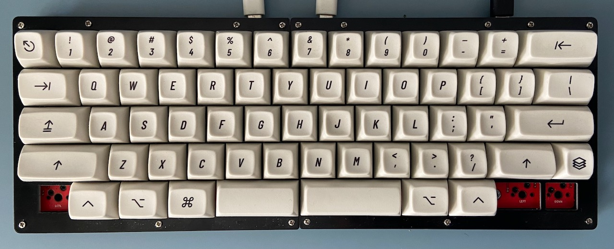
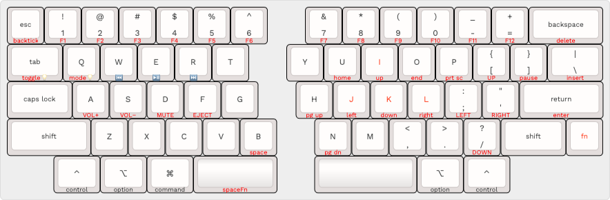

# Keebio _Quefrency Rev. 4_ - 60%

KLE layout: <http://www.keyboard-layout-editor.com/#/gists/69eaf79c79cee5e88ad23d3aa2c4c905>

A <strong><s>61</s> 65-key QWERTY split staggered keyboard layout</strong> for macOS, inspired by [HHKB](https://hhkb.io/layout/) and [SpaceFn](https://geekhack.org/index.php?topic=51069.0) layouts.

Tenkeyless access to <strong>85 keys</strong> of the US ANSI 104-key layout — plus <strong>media keys</strong> & <strong>underglow lighting control</strong> — using <strong>one (1) layer</strong>.

Uses [Quefrency Rev. 4](https://keeb.io/collections/quefrency-split-staggered-65-keyboard/products/quefrency-rev-4-65-split-staggered-keyboard) hotswap PCBs with left macro section and rightmost column broken off.

## Rationale

I have been using split keyboards since 2019 to combat RSI, starting with the [Kinesis Freestyle RGB](https://gaming.kinesis-ergo.com/edge/). I soon started building my own custom boards using kits from [Keebio](https://keeb.io).

This is the layout of my current daily driver: a red [Quefrency Rev. 4](https://keeb.io/collections/keyboard-pcbs/products/quefrency-rev-4-65-split-staggered-keyboard) demo unit. The PCB doesn't support split backspace — and dimensions are a little off from the production model — but has hotswap sockets, underglow lighting, [QMK](https://qmk.fm/) firmware, and [VIA](https://www.caniusevia.com/) support.

Bottom row keys are center-aligned, leaving blockers on both corners.

**I do not like the placement of the <kbd>Control</kbd> key in the HHKB layout.** When typing <kbd>Ctrl</kbd>-<kbd>A</kbd> for instance, the little finger moves to <kbd>Ctrl</kbd>, and <kbd>A</kbd> is hit with the ring finger. My left pinky is my weakest finger, so holding and releasing a modifier with that lateral movement actually causes “Emacs pinky” pain.

Most macOS keyboards with only two bottom row right modifiers put <kbd>Command</kbd> and <kbd>Option</kbd> there. I prefer <kbd>Option</kbd> and <kbd>Control</kbd> for Emacs-style motion shortcuts and key bindings.

I prefer using the <kbd>Shift</kbd> and bottom row mods on the opposite side of the alphanumeric key I'm pressing. Since I use bottom row <kbd>Control</kbd> keys on each corner, <kbd>Caps Lock</kbd> remains located to the left of <kbd>A</kbd>.

A right <kbd>Command</kbd> key would be ideal, but the center-aligned bottom row compensates by putting <kbd>⌘</kbd> conveniently below my left thumb.

### 2025 Update

My Quefrency 60% eventually succumbed to the bottom of a project drawer in lieu of other keyboards: particularly my Keychron V8.

However, I discovered something while playing the <cite>Minecraft</cite> demo with my son on my Mac: the WASD layout on the V8 is awkward. I revived my Drop Alt v1 with a new case, SA Nuclear Data capa, and silent switches as a gaming board. The switches look awesome with the caps but they feel like mush.

As for my Sinc, it&rsquo;s taken a beating and is on the injured list. So I resurrected the Quefrency 60% with a new approach. First I tried them with UT4s and the keys felt really snappy with my SA Dualshot ABS keycaps, but the sound was not great. I swapped the switches with the U4s in the V8. The V8 at least has a case, although it could use some foam to thock the sound of the U4Ts up. Silent switches on the 60% case-less split makes the most sense to me.

Back to gaming, though. I also realized that having <kbd>Control</kbd>l in place of <kbd>Caps Lock</kbd> in the home row is very handy for sprinting in the game. So now I have three Control keys: one to the left of <kbd>A</kbd>, and two in the opposite corners.

All modifiers and function keys are available on both sides of the board now. The previous 61-key layout sacrificed  Right <kbd>Command</kbd>.

Arrow and navigation clusters on a layer are accessible to both sides:

- Left side: Based around WASD
- Right side: HHKB conventions

But fear not, <kbd>Caps Lock</kbd> Lovers! I kept it on the bottom row between <kbd>Command</kbd> and Right <kbd>Alt</kbd>. And a stepped 1.75U cap even! A nice remedy to the arrow blocker gap this arrow-less configuration has.

The only thing I have on my wish list for this board is a 3D-printed middle layer to show off the RGB underlighting. I don&rsquo;t know if a case from Tree Dog will work for my demo PCB, and maybe it's not worth it.

-----

## Another influence: the _Apple M0110_

The first _Macintosh_ keyboards — with those beautiful blockers that inspired the HHKB — had a single left <kbd>Command</kbd> key.

An <kbd>Enter</kbd> key — distinct from <kbd>Return</kbd> — was next to the right <kbd>Option</kbd> key for some reason. I remember PowerBooks had <kbd>Enter</kbd> keys in the bottom row as well.

The M0110 had no <kbd>Control</kbd> keys though, and instead of an <kbd>Esc</kbd> key, the <kbd>Command</kbd>-<kbd>.</kbd> shortcut likely sufficed.

-----

I type <kbd>Space</kbd> primarily with my right thumb, so holding the left spacebar activates the <kbd>Fn</kbd> layer.

I also added access to keys I might need were I ever to troubleshoot a Windows or Linux machine:

* <kbd>Print Screen</kbd> • <kbd>SysRq</kbd>
* <kbd>Pause</kbd> • <kbd>Break</kbd>
  
On macOS, these keys are  <kbd>F13</kbd> and <kbd>F15</kbd>, respectively.

## Layout

* 1.25u <kbd>Control</kbd> and <kbd>Option</kbd> keys on left and right sides
* 1.25u <kbd>Command</kbd> key on left side only
* 1.75u <kbd>Caps Lock</kbd> to the left of <kbd>A</kbd> key
* Holding down Left <kbd>Space</kbd> activates <kbd>Fn</kbd> layer, like in <strong>SpaceFn</strong>:
  * <kbd>`</kbd>  on <kbd>Esc</kbd>
  * <kbd>F1</kbd> … <kbd>F12</kbd> on <kbd>1</kbd> … <kbd>=</kdb>
  * <kbd>Print Screen</kbd> on <kbd>P</kbd>
  * <kbd>Pause</kbd> on <kbd>]</kbd>
  * Nav cluster:
    * <kbd>Insert</kbd> <kbd>Delete</kbd> <kbd>Page Up</kbd> <kbd>Page Down</kbd> <kbd>Home</kbd> <kbd>End</kbd> on <kbd>\\</kbd> <kbd>Backspace</kbd> <kbd>H</kbd> <kbd>N</kbd> <kbd>U</kbd> <kbd>O</kbd>
  * Arrow cluster:
    * <kbd>Up</kbd> <kbd>Left</kbd> <kbd>Down</kbd> <kbd>Right</kbd> on <kbd>I</kbd> <kbd>J</kbd> <kbd>K</kbd> <kbd>L</kbd>
  * <kbd>Space</kbd> on <kbd>B</kbd>
* Layout also influenced by the <strong>Happy Hacking Keyboard</strong>:
  * Three (3) keyswitch locations left empty for bottom row blockers:
    * 1.25u left blocker
    * 2.5u right blocker
  * 1u <kbd>Fn</kbd> key next to Right <kbd>Shift</kbd>
  * Numpad <kbd>Enter</kbd> on <kbd>Return</kbd>
  * Additional arrow cluster:
    * <kbd>Up</kbd> <kbd>Left</kbd> <kbd>Down</kbd> <kbd>Right</kbd> on <kbd>=</kbd> <kbd>;</kbd> <kbd>/</kbd> <kbd>'</kdb>
  * Media keys:
    * <kbd>Vol +</kbd> <kbd>Vol &minus;</kbd> <kbd>Mute</kbd> <kbd>Eject</kbd> on <kbd>A</kbd> <kbd>S</kbd> <kbd>D</kbd> <kbd>F</kbd>
* Additional Media keys:
  * <kbd>Previous</kbd> <kbd>Play/Pause</kbd> <kbd>Next</kbd> on <kbd>W</kbd> <kbd>E</kbd> <kbd>R</kbd>
* Lighting control:
  * <kbd>Toggle On/Off</kbd> & <kbd>Next Mode</kbd> on <kbd>Tab</kbd> and <kbd>Q</kbd>
* Five (5) stabilized keys:
  * 2u <kbd>Backspace</kbd>
  * 2.25u <kbd>Return</kbd>
  * 2.25u left <kbd>Shift</kbd>
  * 2.25u left spacebar
  * 2.75u right spacebar

-----

_Last Updated:_ 2025-07-03
