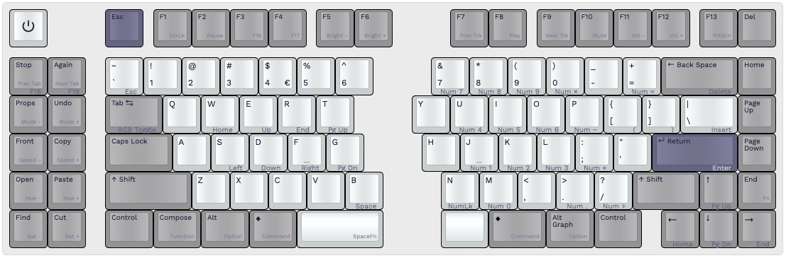

# Keebio <em>Sinc Rev. 4</em> - 75% (macro)

<http://www.keyboard-layout-editor.com/#/gists/176fb4b77b2ae1a718e536f923f7a414>

---

Prooduct page on [Keeb.io](https://keeb.io/collections/sinc/products/sinc-rev-4-split-staggered-75-keyboard)

A <strong>93-key QWERTY split staggered keyboard layout</strong>, inspired by the Sun Type 5 & Type 6 keyboards.

* 2 rotary encoders soldered in corners
* 2u Backspace
* Split right space (1.25u + 1.5u Command key)
* <s>Stepped <kbd>Caps Lock</kdb></s>
* 10 [Sun fun cluster](https://deskthority.net/wiki/Fun_cluster#Sun) keys on macro section:
  * <kbd>Stop</kbd> <kbd>Again</kbd>
  * <kbd>Props</kbd> <kbd>Undo</kbd>
  * <kbd>Front</kbd> <kbd>Copy</kbd>
  * <kbd>Open</kbd> <kbd>Paste</kbd>
  * <kbd>Find</kbd> <kbd>Cut</kbd>
  * No <kbd>Help</kbd> key
* <s><kbd>Fn</kbd> + <kbd>F7</kbd> to access numpad</s>
* <kbd>Print Screen</kbd> seen as <kbd>F13</kbd> on macOS
* <kbd>Scroll Lock</kbd> on <kbd>Fn</kbd>+ <kbd>F8</kbd>, seen as <kbd>F14</kbd> on macOS
* <kbd>Pause</kbd> on <kbd>Fn</kbd> + <kbd>Stop</kbd>, seen as <kbd>F15</kbd> on macOS
* <s><kbd>F16</kbd> … <kbd>F19</kbd> on <kbd>Fn</kbd> layer of left column macro keys</s>

## Keycaps

[NicePBT Type 6](https://cannonkeys.com/products/nicepbt-type-6)

## References

* _Deskthority Wiki_: [Sun Compact 1](https://deskthority.net/wiki/Sun_Compact_1).
