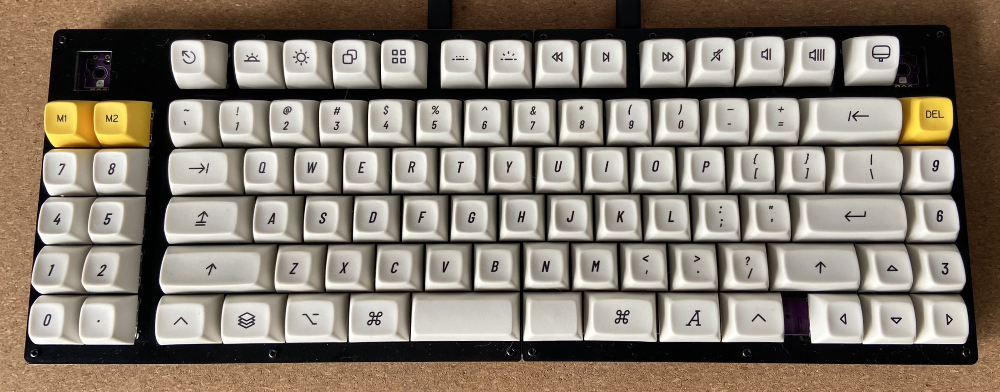
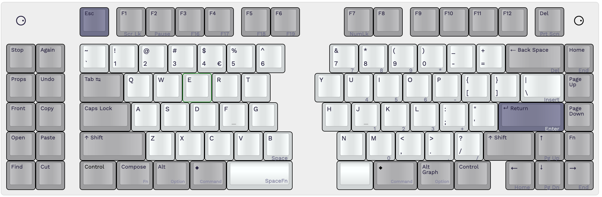
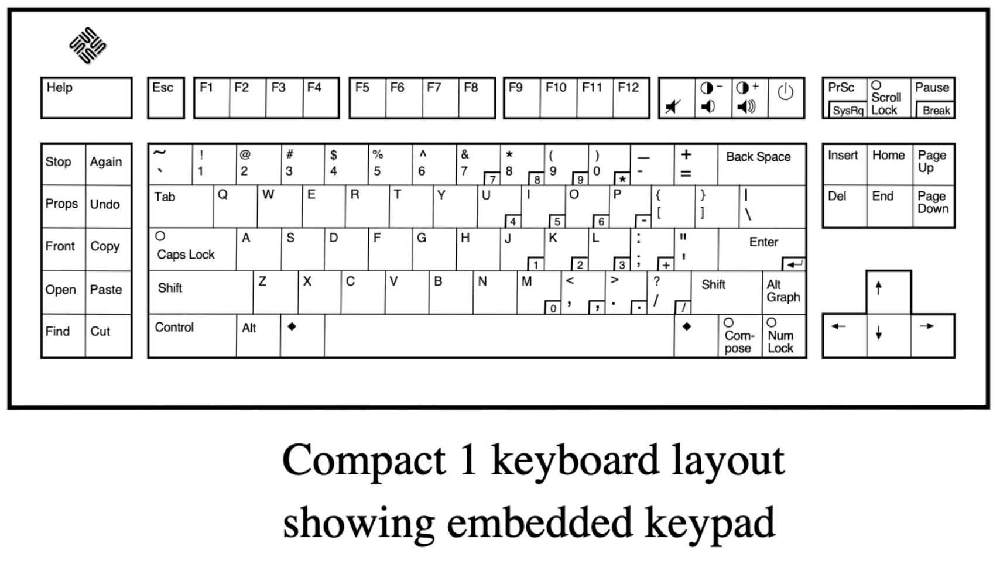
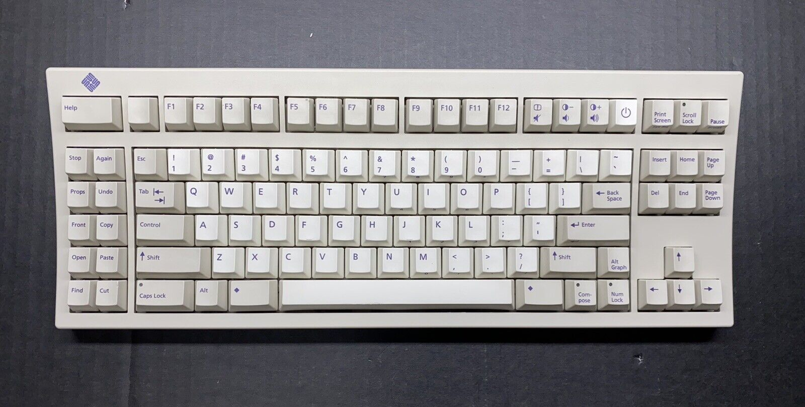

# Keebio <em>Sinc Rev. 4</em> - 75% (macro)

I am in progress of building a [Keebio Sinc Rev. 4 hotswap split keyboard](https://keeb.io/collections/sinc/products/sinc-rev-4-split-staggered-75-keyboard). It will eventually have two encoders soldered in the corners. Here is a picture of it with [MT3 Extended 2048](https://drop.com/buy/drop-biip-mt3-extended-custom-keycap-set) keycaps, with some pop from [MT3 Serika R2](https://drop.com/buy/drop-zambumon-mt3-serika-custom-keycap-set):

Thinking about getting this set: [NicePBT Type 6](https://cannonkeys.com/products/nicepbt-type-6)

<http://www.keyboard-layout-editor.com/#/gists/176fb4b77b2ae1a718e536f923f7a414>

---

Prooduct page on 

A <strong>94-key QWERTY split staggered keyboard layout</strong>, inspired by the Sun Type 5 & Type 6 keyboards.

* 2 rotary encoders soldered in corners
* 2u <kbd>Backspace</kbd>
* 2.25u left <strong>SpaceFn</strong> key
* Split right space: convex 1.25u + 1.5u <kbd>Command/Meta</kbd> key
* Access to all keycodes found on a full-size US English Apple keyboard
  * Except a real <kbd>Fn</kbd> / “Globe” key
* Access to all Windows keys escape <kbd>Menu</kbd>
  * Use <kbd>Shift</kbd> + <kbd>F10</kbd> instead
* Sun Compact 1 style numeric keypad on layer
* <kbd>Home</kbd> key in <kbd>F13</kbd> position
* <kbd>Home</kbd> is <kbd>Print Screen</kbd> / <kbd>F13</kbd> on layer
* <kbd>Escape</kbd> is <kbd>Eject</kbd> on layer

## Layout options

* 1.5u <kbd>Backspace</kbd>
* F-row <kbd>Escacpe</kbd> key replaced with <kbd>Help</kbd>, <kbd>Print Screen</kbd>, <kbd>⏻</kbd>, or blank keycap
* <kbd>Print Screen / SysReq</kbd> key in <kbd>F13</kbd> position
* <kbd>Scroll Lock</kbd> on <kbd>Fn</kbd>+ <kbd>F8</kbd>, seen as <kbd>F14</kbd> on macOS
* <kbd>Pause</kbd> on <kbd>Fn</kbd> + <kbd>Stop</kbd>, seen as <kbd>F15</kbd> on macOS
* <kbd>F16</kbd> … <kbd>F19</kbd> on <kbd>Fn</kbd> layer of left column macro keys
* <kbd>Delete</kbd> key to right of <kbd>Backspace</kbd>
* Key to right of <kbd>Up</kbd> is <kbd>End</kbd> on tap, and <kbd>Fn</kbd> on hold
* <kbd>`</kbd> key is <kbd>Escape</kbd> on layer
* F-row <kbd>Escacpe</kbd> key replaced with <kbd>Help</kbd>, <kbd>Print Screen</kbd>, <kbd>⏻</kbd>, or blank keycap
* [ ] 10 [Sun fun cluster](https://deskthority.net/wiki/Fun_cluster#Sun) layer on macro section:
  * <kbd>Stop</kbd> <kbd>Again</kbd>
  * <kbd>Props</kbd> <kbd>Undo</kbd>
  * <kbd>Front</kbd> <kbd>Copy</kbd>
  * <kbd>Open</kbd> <kbd>Paste</kbd>
  * <kbd>Find</kbd> <kbd>Cut</kbd>
  * <kbd>Help</kbd> key
* [ ] Hack firmware to spoof an Apple-manufactured board to access true <kbd>Fn</kbd> “Globe” key

## References

* _Deskthority Wiki_: [Sun Compact 1](https://deskthority.net/wiki/Sun_Compact_1).
* [_SPARCstation Voyager: Just the Facts_](https://janit.iki.fi/docs/SPARCstationVoyagerJTF.pdf). Sun Microsystems, March 1994.
* eBay listing: [Sun 320-1196 Compact 1 Keyboard, Mini-Din, US/UNIX Layout, Vintage Sun](https://www.ebay.com/itm/165992674326)
