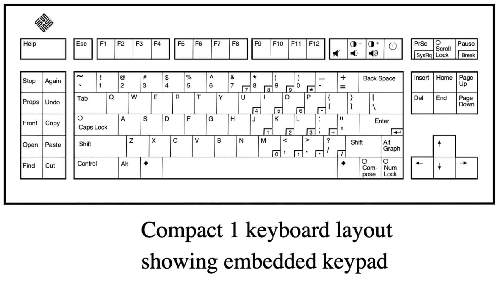

# Keebio _Sinc Rev. 4_ - split 75%

I built a [Keebio Sinc Rev. 4 hotswap split keyboard](https://keeb.io/collections/sinc/products/sinc-rev-4-split-staggered-75-keyboard). It is a [QMK](https://qmk.fm/) keyboard that is programmable with [VIA](https://usevia.app/).

Here is a picture of it with [Drop + biip MT3 Extended 2048](https://drop.com/buy/drop-biip-mt3-extended-custom-keycap-set) keycaps, with some  [Drop + Zambumon MT3 Serika R2](https://drop.com/buy/drop-zambumon-mt3-serika-custom-keycap-set) accents:

NicePBT Type 6 layout:
<http://www.keyboard-layout-editor.com/#/gists/176fb4b77b2ae1a718e536f923f7a414>

Colorway and legends from [NicePBT Type 6](https://cannonkeys.com/products/nicepbt-type-6) set from CannonKeys

-----

_96-key QWERTY split staggered keyboard layout_, inspired by Apple, IBM, and Sun keyboards.

## Layout details

* Access to all keycodes found on a full-size US English Apple keyboard
  * Except a real <kbd>Fn</kbd> (Globe) key
* Minimum mod width: 1.25u
  * Sorry, I can't do 1u right mods
  * I love the 0.5u blocker between Right <kbd>Control</kbd> & the arrow cluster
* 2u <kbd>Backspace</kbd>
* 2.25u left _SpaceFn_ key activates Layer 1 on Hold / Space on Tap
* Split right space: convex 1.25u + 1.5u <kbd>Command</kbd> / <kbd>Win</kbd> / <kbd>Super</kbd> / <kbd>◆</kbd> (Meta) key
* 0.5u blocker to left of arrow cluster
* F-row loosely mimics macOS function keys
  * <kbd>Scroll Lock</kbd> / <kbd>F14</kbd> and <kbd>Pause</kbd> / <kbd>F15</kbd> in <kbd>F1</kbd> & <kbd>F2</kbd> position and handle screen brightness
  * Positions <kbd>F3</kbd> & <kbd>F4</kbd> are <kbd>F16</kbd> & <kbd>F17</kbd>
    * Via macOS System Preferences _Keyboard_ pane, I can assign these to:
      * _Show Notification Center_
        * Mission Control is better handled with <kbd>Control</kbd> + arrow keys
        * This key was used for Expose back in the day, anyway!
        * When modified with <kbd>Command</kbd>, it will _Show Desktop_
      * _Show Launchpad_
* Access to all Windows keys except <kbd>Menu</kbd>
  * Use <kbd>Shift</kbd> + <kbd>F10</kbd> instead
* Left-side: Navigation cluster on Layer 1
* Right-side: Full Apple numeric keypad on Layer 1
  * <kbd>Return</kbd>: Numpad <kbd>Enter</kbd>
  * <kbd>-</kbd> (hyphen-minus): <kbd>Clear</kbd> (macOS) / <kbd>Num Lock</kbd> (Win)
  * <kbd>=</kbd>: Numpad <kbd>=</kbd> (macOS)
* <kbd>F13</kbd> / <kbd>Print Screen</kbd>
* <kbd>Del</kbd> key in <kbd>F14</kbd> position
* <kbd>Escape</kbd> is <kbd>Eject</kbd> key on layer

## TODO

* [x] 11-key [Sun fun cluster](https://deskthority.net/wiki/Fun_cluster#Sun) macro section on Layer 1:
  * <kbd>Stop</kbd> <kbd>Again</kbd>
  * <kbd>Props</kbd> <kbd>Undo</kbd>
  * <kbd>Front</kbd> <kbd>Copy</kbd>
  * <kbd>Open</kbd> <kbd>Paste</kbd>
  * <kbd>Find</kbd> <kbd>Cut</kbd>
  * <kbd>Help</kbd> key
* [ ] Hack firmware to spoof an Apple-manufactured board to access true <kbd>Fn</kbd> “Globe” key

-----

## References

* _Deskthority Wiki_: [Sun Compact 1](https://deskthority.net/wiki/Sun_Compact_1).
* [_SPARCstation Voyager: Just the Facts_](https://janit.iki.fi/docs/SPARCstationVoyagerJTF.pdf). Sun Microsystems, March 1994.
* eBay listing: [Sun 320-1196 Compact 1 Keyboard, Mini-Din, US/UNIX Layout, Vintage Sun](https://www.ebay.com/itm/165992674326)
